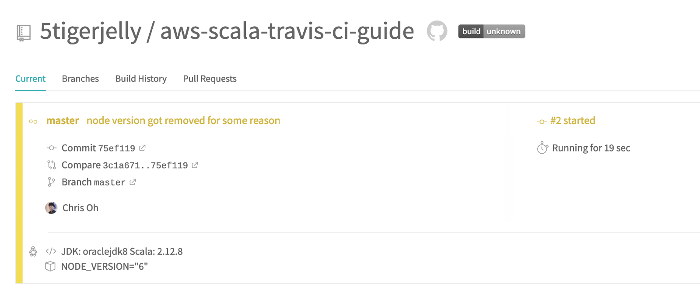

I have spent the last week learning about the best way to deploy a Scala serverless lambda function into AWS using Travis CI. I have hit so many roadblocks on the way that no one should go through what I did. The code in this [post is here](https://github.com/5tigerjelly/aws-scala-travis-ci-guide).

#### Prerequisite

I will assume you already know and have an Amazon Web Service (AWS) account. If you don’t, please go make one. You will also need a GitHub account.

#### High-Level Picture

1.  We will create a lambda function using the serverless framework.
2.  We will create an IAM role on AWS and provide it to Travis CI
3.  We will use Travis CI to auto-deploy to AWS every time we commit

---

 on [Unsplash](https://unsplash.com?utm_source=medium&utm_medium=referral)](./asset-2)

### Serverless Framework

The Serverless Framework is an open source tool to generate lambda function templates. It will generate the boilerplate needed to serve a basic lambda function. It can connect to any provider, such as Google Cloud Platform, Microsoft Azure, IBM OpenWhisk and so on. In this example, I will be deploying to AWS.

First, you will need to install the serverless cli on your machine by running

```
# Installing the serverless cli
npm install -g serverless
```

Once you have installed the framework, let’s create the aws-scala boilerplate! If you are interested in another language or different provider, check the [list of templates here](https://github.com/serverless/serverless/tree/master/lib/plugins/create/templates).

```
# Create a new Serverless Service/Project
serverless create --template aws-scala-sbt --path my-service

# Change into the newly created directory
cd my-service
```

You can already see the magic template appear once you open it in an editor.


Now the basic code it there, head over to the `serverless.yml` file. We need to slightly edit the configuration.

Let’s change the service name to `my-scala-lambda` just for the heck of it, under function->hello->handler change the `hello.Handler` to `hello.ApiGatewayHandler`. Also, let's add an `events` so the serverless framework will also generate an API gateway for us to ping.

Embed placeholder 0.6793423043335334

---

 on [Unsplash](https://unsplash.com?utm_source=medium&utm_medium=referral)](./asset-4)

### GitHub

_TLDR : If you are a GitHub guru, git initialize this repo and push it to GitHub._

Let’s initialize this folder into a git repository and push it, so your peers can appreciate this fine code you wrote. I like to create the repo first in GitHub, so let’s do that. Create a **public** GitHub repo, and **DO NOT Initialize this repository with a README.**


After creating follow the script under **…or create a new repository on the command line.** But add all files, not just the `README.md`.


For me, it would be

```
echo "# aws-scala-travis-ci-guide" >> README.md
git init
git add .
git commit -m "first commit"
git remote add origin git@github.com:5tigerjelly/aws-scala-travis-ci-guide.git
git push -u origin master
```

Now refresh the GitHub repo website!


You will see all the lambda code pushed to GitHub!

---

 on [Unsplash](https://unsplash.com?utm_source=medium&utm_medium=referral)](./asset-8)

### Amazon Web Service

#### Create an IAM role

We will need to create an IAM role for Travis so it will be able to create AWS resources and deploy our lambda code there. Let’s head to the AWS console. Go to Services -> IAM -> Users. Add a new user, set an appropriate name, like `travis-ci` and check **Programmatic access**. Click on **next: Permissions.**

#### Create Policy

In the **Attach existing policies directly** tab, create a policy and paste the JSON below.

Embed placeholder 0.48386435205212086

After creating this policy go back to the user creation, refresh the policies and select the one we just created. Skip tags, and create the user!

#### Download access key and secret access key


This page will **never be shown to you ever again**, so just download the CSV file. Once you have downloaded the key, we don’t need to do anything with AWS. We will come back later to check up on the status, but that will be it.

---

 on [Unsplash](https://unsplash.com?utm_source=medium&utm_medium=referral)](./asset-10)

### Travis CI

Head over to [travis-ci.org](http://travis-ci.org), there you can deploy opensource projects for free. If you would like to deploy private projects, you will need to pay the upgraded version.

Sign in with GitHub, head to your settings, sync account and toggle the repo we created!


Now, when we push this repo to GitHub, Travis-CI will look for a `.travis.yml` file, which contains the configuration we want. A virtual machine will boot up and run the commands needed.

#### Create `.travis.yml` file

Head back to the code editor, and on the root level of the folder structure, create a new file titled

```
.travis.yml
```

Then you will need to paste this code.

Embed placeholder 0.4744713183632834

I think this is the real take away of this post. I spent quite some time coming up with this. There are many versions of this file, but this is the one that really worked for me.

#### Add access keys

Now we need to add our AWS access key and secret access key. There are two different ways you can do it.

1.  Encrypt the key and add it to `.travis.yml` this will be public on GitHub, but no one is able to decode it.
2.  Set the environment variable in the Travis-ci website under settings.

This really depends on your personal taste. I tried both and prefer the first method. If I am collaborating with someone else on this project, and a new IAM needed to be created, the other person will have to be given permission to edit on Travis, if you start having larger teams, this becomes a hassle. There might be a team management tool in Travis, but it means I have to do the overhead. So its easier to stick the encoded variables right in Travis. You can find more details about [Travis encryption here](https://docs.travis-ci.com/user/encryption-keys/).

```
#install travis, you will need to have ruby
gem install travis

#inside your repo add your keys from the csv file
travis encrypt AWS_ACCESS_KEY_ID="<your key here>" --add
travis encrypt AWS_SECRET_ACCESS_KEY="<your key here>" --add
```

Once you run the code, look back at your `.travis.yml` a long string of cryptic text is added. This is your access key and secret access key. To be honest, it is okay to leave the access key as is, and only encrypt the secret access key, but what could be so bad about being extra careful.


Once the two keys are added, no one can even tell that the global variables set are AWS related.

---

 on [Unsplash](https://unsplash.com?utm_source=medium&utm_medium=referral)](./asset-13)

### Lights, Camera, Action!

Let's see if all this time spent was actually worth it!

```
git add .
git commit -m "adding travis.yml and secure keys"
git push
```

You will see the Travis come to life. It will spit out a lot of things. It will run `sbt assemly` and create the target jar file, packaging everything. Then the serverless framework will take that jar, head over to AWS and deploy a cloud formation template to create all the resources needed. The jar file is uploaded into an S3 bucket, also auto-generated. It will create a lambda function and attach the API gateway.


This is what you will see if all the stars aligned. Go to the endpoint printed in the output. Make sure to grab the `endpoints` link, not the `ServiceEndpoint` link. We didn’t define anything for the root directory so you will get an error.


---

 on [Unsplash](https://unsplash.com?utm_source=medium&utm_medium=referral)](./asset-17)

### Summary

In this post, we covered a wide range of tools and frameworks. First, we created the lambda function code using the serverless framework. Next, we created a GitHub repo to host our code. Then, we created an AWS IAM role and gave the credentials to travis.yml. Last, we committed our code and saw the AWS resources getting created and outputting the endpoint we can use.

All the code in this post can be [found here](https://github.com/5tigerjelly/aws-scala-travis-ci-guide). _Happy coding!_