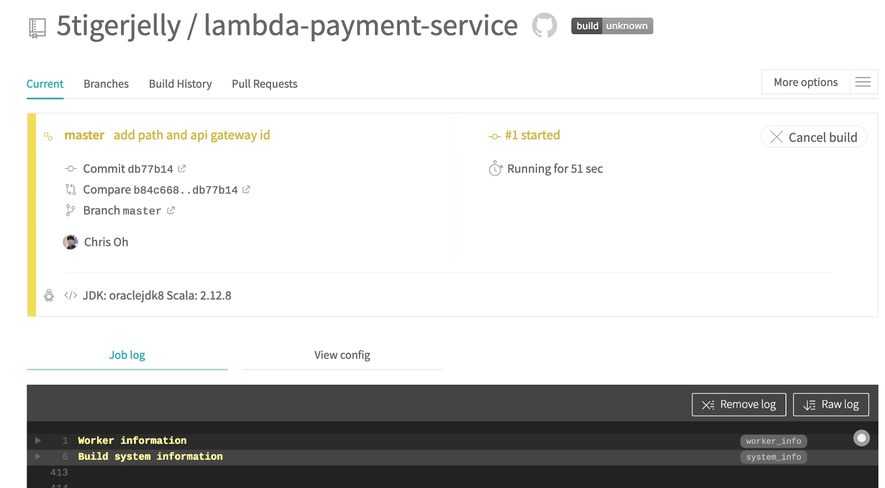

_In this post, we will deploy multiple serverless lambda functions with independent deployment pipelines, using the same APIGateway endpoint._


Lambda functions are amazing, but to scale and add more functionality, the physical file size of packages become a limit. [AWS states these package sizes as the limit](https://docs.aws.amazon.com/lambda/latest/dg/limits.html). It makes sense to break down different parts of the program which can be independent as a separate serverless function.


However, there is still the problem that, if every serverless lambda deploys with its own APIGateway endpoint, you will end up with multiple different URL endpoints. Keeping track of the different endpoints and also updating multiple different clients will become a massive hassle.

The amazing predecessors already thought of [this back in 2016](https://forum.serverless.com/t/multiple-services-behind-a-single-api-gateway/191/12). The forum started having conversations about this, and it wasn’t until 2017 when it was [officially opened for code implementation and review](https://github.com/serverless/serverless/issues/3078). On January 6th, 2019, [PR #4247 was finally merged](https://github.com/serverless/serverless/pull/4247).

---

 on [Unsplash](https://unsplash.com?utm_source=medium&utm_medium=referral)](./asset-3)

### Create Repos from Boilerplate

[**The Ultimate Scala Serverless Lambda Deployment using Travis CI**  
_I have spent the last week learning about the best way to deploy a Scala serverless lambda function into AWS using…_medium.com](https://medium.com/@5tigerjelly/the-ultimate-scala-serverless-lambda-deployment-using-travis-ci-18ddc681769f "https://medium.com/@5tigerjelly/the-ultimate-scala-serverless-lambda-deployment-using-travis-ci-18ddc681769f")[](https://medium.com/@5tigerjelly/the-ultimate-scala-serverless-lambda-deployment-using-travis-ci-18ddc681769f)

In the previous post, I went over creating Scala serverless lambda deployment pipelines using Travis CI. We will continue to build upon the [boilerplate we made from the last post](https://github.com/5tigerjelly/aws-scala-travis-boiler-plate).


Let’s create two repositories. Go to Import repositories and paste the link. Let’s call one `lambda-account-service` and the other `lambda-payment-service` .

```
https://github.com/5tigerjelly/aws-scala-travis-boiler-plate
```

Once importing is complete, Github will send you a notification.


We should be able to see the two repositories we just made.


---

 on [Unsplash](https://unsplash.com?utm_source=medium&utm_medium=referral)](./asset-7)

### Create an API Gateway

In the previous post, we did not go into the AWS console to create a new API gateway. The serverless framework auto defines the cloud formation template and creates the needed resources. However, as we need to get more fine-grained, I find it easier to manually create the endpoint.


In the AWS console -> Services -> API Gateway -> Create. Select the REST protocol, New API and give it a cool name. Endpoint Type matters if you want it served over the CloudFront (AWS’s CDN). Once you have created the API Endpoint, keep a note of the API’s ID and the API’s root resource ID.


The ID next to the API name is the API ID(`jte3ap5vzd`). The ID right of the ‘Resource’ is the root resource ID(`63l279u23l`).

---

 on [Unsplash](https://unsplash.com?utm_source=medium&utm_medium=referral)](./asset-10)

### Add Config to Serverless.yml

First clone the two repos we created to your machine. Head to [Travis](https://travis-ci.org) and enable the two repos. Then, run the `travis` cli command to add the AWS keys securely.

```
#install travis, you will need to have ruby
gem install travis

#inside your repo add your keys from the csv file
travis encrypt AWS_ACCESS_KEY_ID="<your key here>" --add
travis encrypt AWS_SECRET_ACCESS_KEY="<your key here>" --add
```

When you are done adding the two keys on both repos, inside the `serverless.yml` update the service name to reflect the repo names. Otherwise, we will be very confused when we go into the AWS console to check if both services got deployed correctly. _Another meat of this post._ Under provider add `apiGateway, restApiId, restApiRootResourceId`. Fill in the details from what we got from AWS. Last, update the `path` under `events`. The path will be the first route after the root path.


---

 on [Unsplash](https://unsplash.com?utm_source=medium&utm_medium=referral)](./asset-12)

### Time for some Action

Let’s deploy one service at a time. First, we will deploy the `lambda-account-service`.


_side note : sbt compiling takes a very long time… average 2min 30 just for the sbt assembly part…. please be patient..._


If the deployment worked, you should be able to see the `/accounts` route is created. We are now able to ping the API + `/accounts` and be able to see the results. Now let’s deploy the `lambda-payment-service`.



If the deploy worked, check out the API gateway page! You shouldn’t see any other API endpoints other than the one we created earlier in the post. And under the root resource, we will now see the newly added `/payments`.


Just to double check, everything worked, let’s also check the lambda functions. You can observe that the two repos created the corresponding functions.


---

 on [Unsplash](https://unsplash.com?utm_source=medium&utm_medium=referral)](./asset-18)

### Summary

In this post, we created two services using the [boilerplate](https://github.com/5tigerjelly/aws-scala-travis-boiler-plate). Then we manually created an AWS API Gateway endpoint to retrieve the ID and root resource ID. Next, we added the two IDs to the service’s `serverless.yml`file. Once we deployed the two services, we saw that both services were created under the API Gateway we defined, not creating separate endpoints.

Happy coding! :)